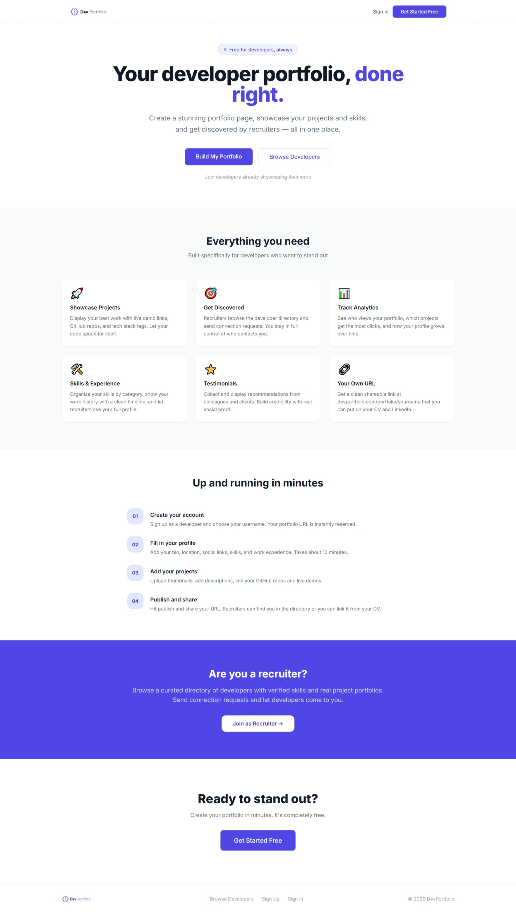
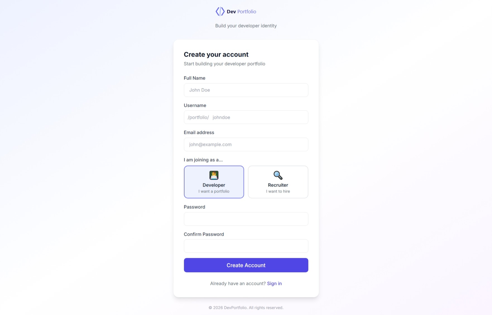
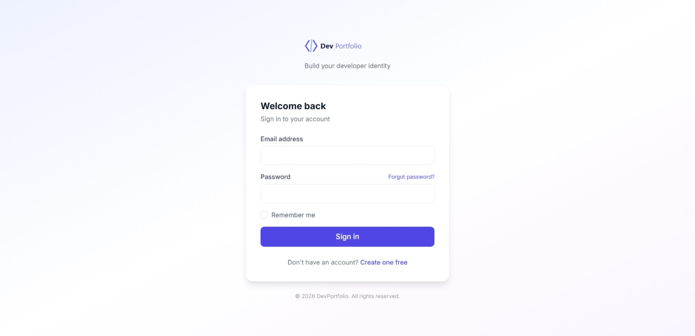
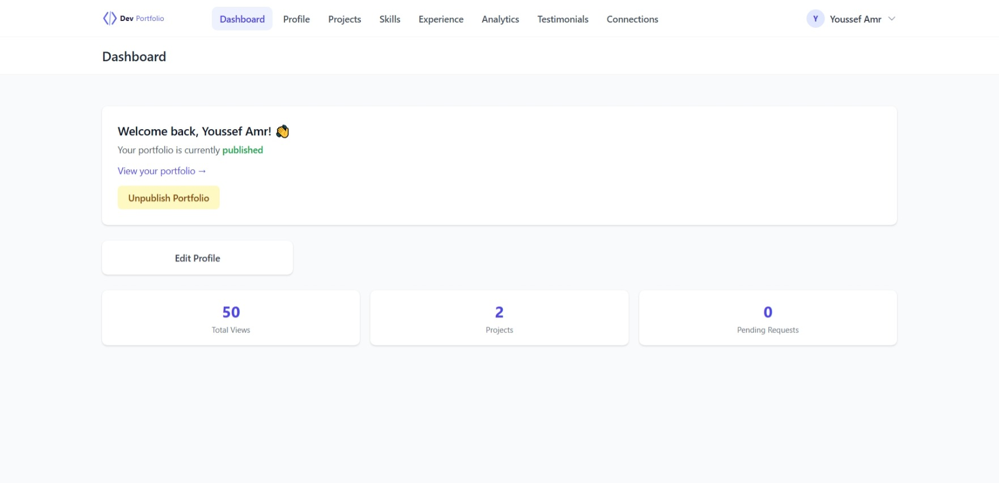
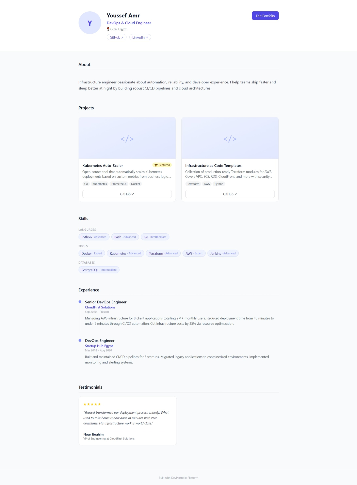
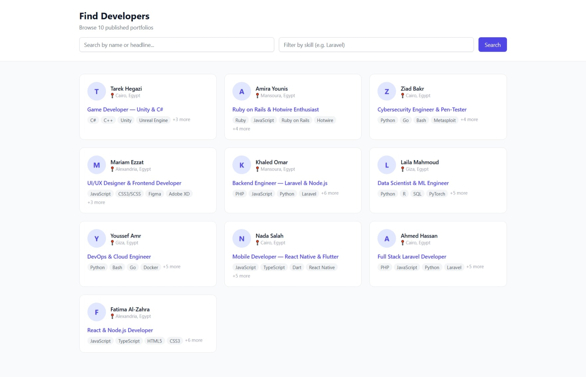
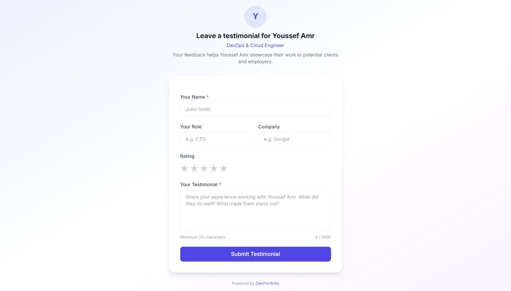
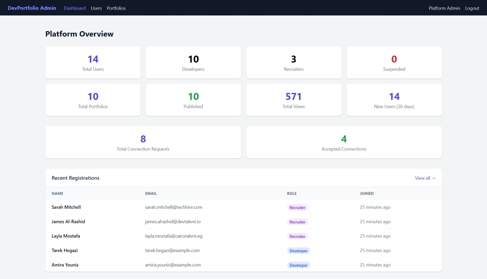

<div align="center">


<br/><br/>

```
██████╗ ███████╗██╗   ██╗    ██████╗  ██████╗ ██████╗ ████████╗███████╗ ██████╗ ██╗     ██╗ ██████╗
██╔══██╗██╔════╝██║   ██║    ██╔══██╗██╔═══██╗██╔══██╗╚══██╔══╝██╔════╝██╔═══██╗██║     ██║██╔═══██╗
██║  ██║█████╗  ██║   ██║    ██████╔╝██║   ██║██████╔╝   ██║   █████╗  ██║   ██║██║     ██║██║   ██║
██║  ██║██╔══╝  ╚██╗ ██╔╝    ██╔═══╝ ██║   ██║██╔══██╗   ██║   ██╔══╝  ██║   ██║██║     ██║██║   ██║
██████╔╝███████╗ ╚████╔╝     ██║     ╚██████╔╝██║  ██║   ██║   ██║     ╚██████╔╝███████╗██║╚██████╔╝
╚═════╝ ╚══════╝  ╚═══╝      ╚═╝      ╚═════╝ ╚═╝  ╚═╝   ╚═╝   ╚═╝      ╚═════╝ ╚══════╝╚═╝ ╚═════╝
```

### 🚀 A full-featured SaaS platform where developers build stunning portfolio pages and recruiters discover top talent

[Live Demo](#) · [Report Bug](https://github.com/Abdulrahman1Fiqi/DevPortfolio-Platform/issues) · [Request Feature](https://github.com/Abdulrahman1Fiqi/DevPortfolio-Platform/issues)

</div>

---

## 📸 Screenshots


<details>
<summary><b>🏠 Landing Page</b></summary>
<br/>




</details>

<details>
<summary><b>📋 Developer Registration & Login</b></summary>
<br/>




</details>

<details>
<summary><b>📊 Developer Dashboard</b></summary>
<br/>



</details>

<details>
<summary><b>🌐 Public Portfolio Page</b></summary>
<br/>




</details>

<details>
<summary><b>🔍 Developer Directory</b></summary>
<br/>




</details>

<details>
<summary><b>⭐ Testimonial Submission</b></summary>
<br/>




</details>

<details>
<summary><b>🛡️ Admin Panel</b></summary>
<br/>




</details>


## 📖 Table of Contents

- [About The Project](#-about-the-project)
- [Features](#-features)
- [Tech Stack](#-tech-stack)
- [System Architecture](#-system-architecture)
- [Database Schema](#-database-schema)
- [Getting Started](#-getting-started)
- [Usage](#-usage)
- [User Roles](#-user-roles)
- [API & Routes](#-routes-overview)
- [Project Structure](#-project-structure)
- [Contributing](#-contributing)
- [License](#-license)
- [Contact](#-contact)

---

## 🎯 About The Project

**DevPortfolio Platform** is a multi-role SaaS web application built with Laravel 12. It allows developers to create professional portfolio pages and gives recruiters a dedicated space to discover, filter, and connect with talent — all in one place.

This project was built as a **hands-on learning project** to master:
- Multi-role authentication & middleware
- Service layer architecture (separating business logic from controllers)
- File uploads & storage
- Analytics tracking without a third-party library
- Real-time UI interactions with Alpine.js
- Production-ready seeding with JSON data fixtures

---

## ✨ Features

### 👨‍💻 For Developers
| Feature | Description |
|---------|-------------|
| 🏗️ **Portfolio Builder** | Create a fully customizable public portfolio page |
| 📁 **Projects Showcase** | Add projects with tech stack, demo URL, repo link, and thumbnail |
| 🛠️ **Skills Manager** | Add skills grouped by category with proficiency levels |
| 💼 **Experience Timeline** | Add work experience with company, role, and dates |
| 📊 **Analytics Dashboard** | Track page views, demo clicks, repo clicks with a Chart.js line graph |
| ⭐ **Testimonials System** | Share a unique link — anyone can submit a testimonial without an account |
| 🔗 **Connection Requests** | Receive and respond to recruiter connection requests |
| 🌐 **Publish Control** | Toggle your portfolio between public and private with one click |

### 🧑‍💼 For Recruiters
| Feature | Description |
|---------|-------------|
| 🔍 **Developer Directory** | Browse and search all published developer portfolios |
| 📩 **Connection Requests** | Send personalized connection requests to developers |
| ✉️ **Email Reveal on Accept** | Developer's email is only shared after they accept your request |
| 📋 **Connection Management** | View all pending, accepted, and declined connections |

### 🛡️ For Admins
| Feature | Description |
|---------|-------------|
| 👥 **User Management** | View, suspend, reactivate, and delete user accounts |
| 📂 **Portfolio Moderation** | Unpublish portfolios that violate platform rules |
| 📈 **Platform Dashboard** | Overview of total users, portfolios, and connections |

### 🌍 Public
| Feature | Description |
|---------|-------------|
| 🌐 **Public Portfolio Pages** | Beautiful public pages at `/portfolio/{username}` |
| 📖 **Developer Directory** | Filterable directory of all published developers |
| ⭐ **Testimonial Submission** | Submit testimonials via a unique token link — no login needed |
| 📡 **Click Tracking** | Demo and repo clicks are tracked for developer analytics |

---

## 🛠️ Tech Stack

| Layer | Technology |
|-------|-----------|
| **Backend Framework** | [Laravel 12](https://laravel.com/) (PHP 8.2+) |
| **Frontend Styling** | [Tailwind CSS 3](https://tailwindcss.com/) |
| **Frontend Interactivity** | [Alpine.js 3](https://alpinejs.dev/) |
| **Templating Engine** | Laravel Blade |
| **Database** | MySQL 8.0 |
| **Build Tool** | [Vite](https://vitejs.dev/) via [laravel-vite-plugin](https://github.com/laravel/vite-plugin) |
| **Charts** | [Chart.js](https://www.chartjs.org/) (CDN) |
| **Authentication** | Laravel Breeze (customized) |
| **File Storage** | Laravel Storage (local disk) |
| **Notifications** | Laravel Mail + Database |
| **Fonts** | Inter via [Bunny Fonts](https://fonts.bunny.net/) |

---

## 🏗️ System Architecture

```
┌─────────────────────────────────────────────────────────────┐
│                        HTTP Request                          │
└─────────────────────────┬───────────────────────────────────┘
                          │
                          ▼
┌─────────────────────────────────────────────────────────────┐
│                    Middleware Stack                           │
│  ┌──────────────┐  ┌──────────────┐  ┌──────────────────┐  │
│  │     Auth     │  │ RoleMiddleware│  │  Web Middleware  │  │
│  └──────────────┘  └──────────────┘  └──────────────────┘  │
└─────────────────────────┬───────────────────────────────────┘
                          │
                          ▼
┌─────────────────────────────────────────────────────────────┐
│                      Controllers                             │
│  ┌──────────────┐  ┌──────────────┐  ┌──────────────────┐  │
│  │  Developer/  │  │  Recruiter/  │  │     Admin/       │  │
│  └──────┬───────┘  └──────┬───────┘  └────────┬─────────┘  │
│         │                 │                    │             │
│         └─────────────────┼────────────────────┘            │
│                           ▼                                  │
│                   ┌──────────────┐                          │
│                   │   Services   │  ← Business Logic        │
│                   └──────┬───────┘                          │
└──────────────────────────┼──────────────────────────────────┘
                           │
                           ▼
┌─────────────────────────────────────────────────────────────┐
│                    Eloquent Models                           │
│  User │ Portfolio │ Project │ Skill │ Experience             │
│  Testimonial │ ConnectionRequest │ AnalyticsEvent           │
└─────────────────────────┬───────────────────────────────────┘
                          │
                          ▼
┌─────────────────────────────────────────────────────────────┐
│                       MySQL Database                         │
└─────────────────────────────────────────────────────────────┘
```

---

## 🗄️ Database Schema

```
┌─────────────┐       ┌──────────────┐       ┌─────────────┐
│    users    │       │  portfolios  │       │  projects   │
├─────────────┤       ├──────────────┤       ├─────────────┤
│ id          │──┐    │ id           │──┐    │ id          │
│ name        │  └───▶│ user_id (FK) │  │    │ portfolio_id│◀─┐
│ username    │       │ headline     │  │    │ title       │  │
│ email       │       │ bio          │  │    │ description │  │
│ password    │       │ location     │  │    │ tech_stack  │  │
│ role        │       │ avatar_path  │  │    │ demo_url    │  │
│ is_active   │       │ is_published │  │    │ repo_url    │  │
└─────────────┘       │ social_links │  │    │ is_featured │  │
                      │ testimonial_ │  │    │ sort_order  │  │
                      │   token      │  └───▶└─────────────┘  │
                      └──────────────┘                        │
                             │                                 │
              ┌──────────────┼──────────────────────────────┐ │
              ▼              ▼              ▼                ▼ │
        ┌──────────┐  ┌───────────┐  ┌──────────────┐  ┌────┘
        │  skills  │  │experiences│  │ testimonials │  │
        ├──────────┤  ├───────────┤  ├──────────────┤  │
        │portfolio_│  │portfolio_ │  │ portfolio_id │  │
        │   id     │  │   id      │  │ submitter_   │  │
        │ name     │  │ company   │  │   name       │  │
        │ category │  │ role      │  │ message      │  │
        │proficiency│ │ start_date│  │ rating       │  │
        └──────────┘  │ end_date  │  │ is_approved  │  │
                      └───────────┘  └──────────────┘  │
                                                        │
        ┌───────────────────┐    ┌─────────────────┐   │
        │ analytics_events  │    │connection_reqs  │   │
        ├───────────────────┤    ├─────────────────┤   │
        │ portfolio_id      │    │ recruiter_id    │   │
        │ event_type        │    │ developer_id    │   │
        │ referrer          │    │ message         │   │
        │ country_code      │    │ status          │   │
        │ created_at        │    │ responded_at    │   │
        └───────────────────┘    └─────────────────┘   │
                                                        │
        All tables above are related to portfolios ─────┘
```

---

## 🚀 Getting Started

### Prerequisites

Make sure you have the following installed:

- **PHP** >= 8.2
- **Composer** >= 2.x
- **Node.js** >= 20.x & **npm**
- **MySQL** >= 8.0
- **Git**

---

### Installation

**1. Clone the repository**

```bash
git clone https://github.com/Abdulrahman1Fiqi/DevPortfolio-Platform.git
cd DevPortfolio-Platform
```

**2. Install PHP dependencies**

```bash
composer install
```

**3. Install Node dependencies**

```bash
npm install
```

**4. Set up environment file**

```bash
cp .env.example .env
php artisan key:generate
```

**5. Configure your database**

Open `.env` and update:

```env
DB_CONNECTION=mysql
DB_HOST=127.0.0.1
DB_PORT=3306
DB_DATABASE=devportfolio
DB_USERNAME=root
DB_PASSWORD=your_password
```

**6. Run migrations and seed the database**

```bash
php artisan migrate:fresh --seed
```

This creates all tables and seeds the database with:
- 1 admin account
- 5 developer accounts (with portfolios, projects, skills, experiences, testimonials)
- 3 recruiter accounts
- Sample analytics data (60 days of page views)
- Sample connection requests

**7. Create storage symlink** (for file uploads)

```bash
php artisan storage:link
```

**8. Build frontend assets**

```bash
npm run build
```

**9. Start the development server**

```bash
php artisan serve
```

Visit **http://localhost:8000** 🎉

---

### Development Mode (all services at once)

```bash
composer run dev
```

This starts the Laravel server, queue worker, log watcher, and Vite dev server concurrently.

---

## 👤 Usage

### Default Accounts (after seeding)

| Role | Email | Password |
|------|-------|----------|
| **Admin** | admin@devportfolio.com | password |
| **Developer** | ahmed@devportfolio.com | password |
| **Developer** | fatima@devportfolio.com | password |
| **Developer** | youssef@devportfolio.com | password |
| **Developer** | nada@devportfolio.com | password |
| **Developer** | khaled@devportfolio.com | password |
| **Recruiter** | sarah@techrecruit.com | password |
| **Recruiter** | james@hiringpro.com | password |
| **Recruiter** | layla@talentbridge.com | password |

### Visiting Public Portfolios

After seeding, visit any developer's public portfolio:

```
http://localhost:8000/portfolio/ahmed
http://localhost:8000/portfolio/fatima
http://localhost:8000/portfolio/youssef
http://localhost:8000/portfolio/nada
http://localhost:8000/portfolio/khaled
```

### Developer Directory

```
http://localhost:8000/developers
```

---

## 👥 User Roles

### 🧑‍💻 Developer
After registering as a developer, you can:

1. **Edit your profile** → `/dashboard/profile`
2. **Add projects** → `/dashboard/projects/create`
3. **Manage skills** → `/dashboard/skills`
4. **Add experience** → `/dashboard/experience/create`
5. **View analytics** → `/dashboard/analytics`
6. **Share testimonial link** → `/dashboard/testimonials`
7. **Manage connections** → `/dashboard/connections`
8. **Publish your portfolio** → Toggle from the profile page

### 🧑‍💼 Recruiter
After registering as a recruiter, you can:

1. **Browse developers** → `/developers`
2. **Send connection requests** → From any developer's public portfolio
3. **Manage connections** → `/recruiter/connections`

### 🛡️ Admin
Log in with the admin account to access:

1. **User management** → `/admin/users`
2. **Portfolio moderation** → `/admin/portfolios`
3. **Platform overview** → `/admin/dashboard`

---

## 🗺️ Routes Overview

```
Public Routes
─────────────────────────────────────────────────
GET  /                          Landing page
GET  /portfolio/{username}      Public portfolio
GET  /developers                Developer directory
GET  /testimonial/{token}       Testimonial submission form
POST /testimonial/{token}       Submit testimonial
POST /analytics/track           Track click events

Developer Routes  (auth + role:developer)
─────────────────────────────────────────────────
GET  /dashboard                 Dashboard home
GET  /dashboard/profile         Edit profile
POST /dashboard/profile         Update profile
PATCH /dashboard/portfolio/...  Toggle publish
GET  /dashboard/projects        Project list
POST /dashboard/projects        Create project
GET  /dashboard/projects/{id}   Edit project form
PUT  /dashboard/projects/{id}   Update project
DEL  /dashboard/projects/{id}   Delete project
GET  /dashboard/skills          Manage skills
POST /dashboard/skills          Add skill
DEL  /dashboard/skills/{id}     Remove skill
GET  /dashboard/experience      Experience list
POST /dashboard/experience      Add experience
GET  /dashboard/analytics       Analytics chart
GET  /dashboard/testimonials    Manage testimonials
PATCH .../testimonials/{id}/approve  Approve
DEL  .../testimonials/{id}      Remove testimonial
GET  /dashboard/connections     Connection requests

Recruiter Routes  (auth + role:recruiter)
─────────────────────────────────────────────────
GET  /recruiter/dashboard       Recruiter home
GET  /recruiter/connections     Connection list
POST /connections/{username}    Send request
DEL  /recruiter/connections/{id} Cancel request

Admin Routes  (auth + role:admin)
─────────────────────────────────────────────────
GET  /admin/dashboard           Admin home
GET  /admin/users               User list
GET  /admin/users/{user}        User detail
PATCH .../users/{user}/suspend  Suspend user
PATCH .../users/{user}/activate Activate user
DEL  /admin/users/{user}        Delete user
GET  /admin/portfolios          Portfolio list
PATCH .../portfolios/{id}/...   Unpublish
```

---

## 📁 Project Structure

```
DevPortfolio-Platform/
├── app/
│   ├── Http/
│   │   ├── Controllers/
│   │   │   ├── Developer/      ← Developer dashboard controllers
│   │   │   ├── Recruiter/      ← Recruiter controllers
│   │   │   ├── Admin/          ← Admin panel controllers
│   │   │   └── Public/         ← Public-facing controllers
│   │   ├── Middleware/
│   │   │   └── RoleMiddleware.php
│   │   └── Requests/           ← Form Request validation classes
│   ├── Models/
│   │   ├── User.php
│   │   ├── Portfolio.php       ← Auto-generates testimonial_token
│   │   ├── Project.php
│   │   ├── Skill.php
│   │   ├── Experience.php
│   │   ├── Testimonial.php
│   │   ├── ConnectionRequest.php
│   │   └── AnalyticsEvent.php
│   ├── Notifications/
│   │   ├── ConnectionRequestReceived.php
│   │   └── ConnectionRequestAccepted.php
│   ├── Policies/
│   │   └── ProjectPolicy.php
│   └── Services/
│       ├── Developer/
│       │   ├── ProfileService.php
│       │   ├── ProjectService.php
│       │   └── AnalyticsDashboardService.php
│       ├── AnalyticsService.php
│       └── ConnectionService.php
├── database/
│   ├── data/
│   │   ├── developers.json     ← Seed data for 5 developers
│   │   └── recruiters.json     ← Seed data for 3 recruiters
│   ├── factories/
│   │   └── UserFactory.php
│   ├── migrations/             ← 8 migration files
│   └── seeders/
│       └── DatabaseSeeder.php  ← Reads JSON, creates all records
├── resources/
│   ├── css/
│   │   └── app.css             ← Custom component classes
│   ├── js/
│   │   └── app.js              ← Alpine.js bootstrap
│   └── views/
│       ├── admin/              ← Admin panel views
│       ├── auth/               ← Login, register (with role picker)
│       ├── components/         ← Reusable Blade components
│       ├── developer/          ← Developer dashboard views
│       ├── layouts/            ← app, guest, admin, navigation
│       ├── public/             ← Portfolio, directory, testimonial
│       ├── recruiter/          ← Recruiter views
│       └── welcome.blade.php   ← Landing page
├── routes/
│   ├── web.php                 ← All web routes
│   └── auth.php                ← Auth routes (Breeze)
├── screenshots/                ← Add your screenshots here
└── public/
    └── favicon.svg             ← Custom SVG favicon
```

---

## 🔒 Security Features

- **Role-based access control** — middleware prevents cross-role access at the route level
- **Policy authorization** — `ProjectPolicy` ensures developers can only edit their own projects
- **Testimonial tokens** — randomly generated 32-character tokens prevent enumeration attacks
- **Email privacy** — recruiter only sees developer email after the developer explicitly accepts
- **CSRF protection** — all forms use Laravel's `@csrf` token
- **Password hashing** — bcrypt via Laravel's `Hash::make()`
- **Production guard** — seeder refuses to run in production environment
- **Mass assignment protection** — all models use `$fillable`

---

## 🧠 Key Design Decisions

**Why a Service Layer?**
Business logic (file uploads, analytics aggregation, connection notifications) lives in `app/Services/` — not in controllers. This keeps controllers thin and makes the logic reusable and testable.

**Why manual GitHub URL input instead of OAuth?**
Simpler setup, no OAuth app registration required, and developers can link to any Git hosting platform (GitHub, GitLab, Bitbucket) by entering the URL directly.

**Why unique tokens for testimonials?**
Using the portfolio ID (`/testimonial/5`) would allow anyone to guess other developers' submission URLs. A random 32-character token is impossible to guess — you can only reach it if the developer shares it with you directly.

**Why `is_approved = false` by default?**
Developers maintain full control over what appears on their public portfolio. This prevents spam and ensures quality testimonials.

---

## 🤝 Contributing

Contributions are welcome! Here's how:

1. **Fork** the repository
2. **Create** a feature branch: `git checkout -b feature/amazing-feature`
3. **Commit** your changes: `git commit -m 'feat: add amazing feature'`
4. **Push** to the branch: `git push origin feature/amazing-feature`
5. **Open** a Pull Request

### Commit Convention

This project follows [Conventional Commits](https://www.conventionalcommits.org/):

```
feat:     New feature
fix:      Bug fix
docs:     Documentation changes
style:    Formatting, missing semicolons, etc.
refactor: Code restructuring without behavior change
test:     Adding or updating tests
chore:    Build process, dependency updates
```

---

## 📋 Roadmap

- [ ] GitHub OAuth integration
- [ ] Portfolio themes (multiple color schemes)
- [ ] Export portfolio as PDF
- [ ] Skill endorsements between developers
- [ ] Real-time notifications with Laravel Echo
- [ ] Portfolio view counter (public)
- [ ] CSV export for analytics
- [ ] Email notifications for new connection requests
- [ ] Dark mode toggle
- [ ] Portfolio custom domain support

---

## 📄 License

Distributed under the **MIT License**. See [`LICENSE`](LICENSE) for more information.

---

## 📬 Contact

**Abdulrahman Al-Fiqi**

[](https://github.com/Abdulrahman1Fiqi)

**Project Link:** [https://github.com/Abdulrahman1Fiqi/DevPortfolio-Platform](https://github.com/Abdulrahman1Fiqi/DevPortfolio-Platform)

---

<div align="center">

Built with ❤️ using **Laravel 12** · **Tailwind CSS** · **Alpine.js**

⭐ Star this repo if you found it helpful!

</div>
